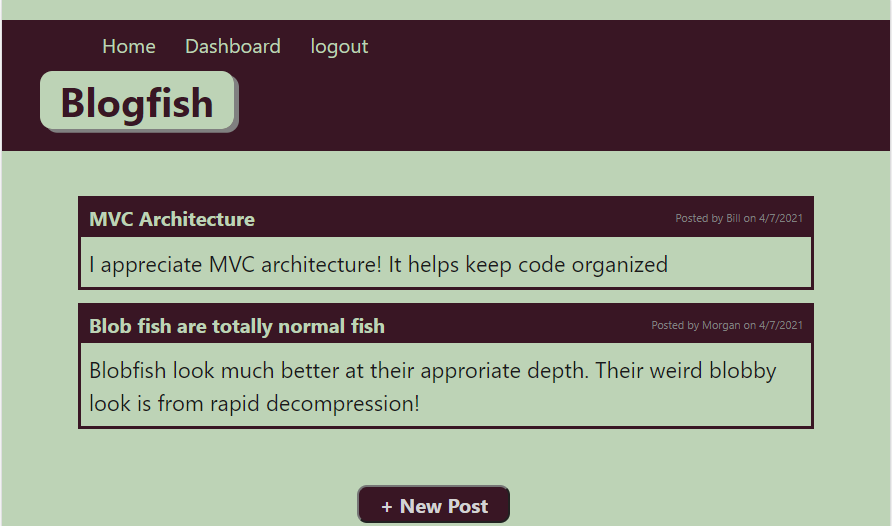
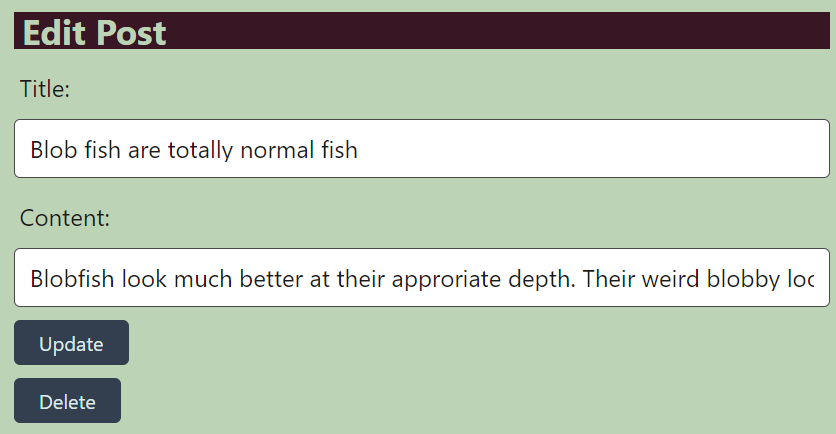
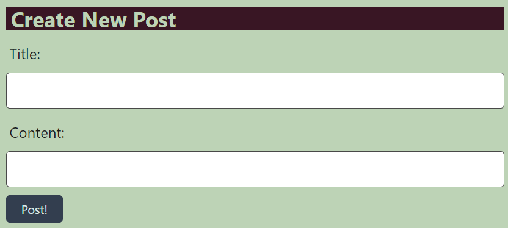

# Blogfish


## Description

Welcome to Blogfish, your destination for discussion of tech and deep sea lifestyle!

-----

## Table of Contents

* [Installation](#installation)
* [Usage](#usage)
* [License](#license)
* [Questions](#questions)


-----

## Installation

To host your own Blogfish server, you will need an SQL instance. Set up the connection in your ``.env`` file, using the ``.env.EXAMPLE`` file as a template.

Install dependency libraries with ``` npm i ``` and launch the server with ``npm start``.

## Usage

On accessing the app, you will be taken to a page where you can choose to log in or sign up. On completing this, you will be directed to the home page of the application, with a listing of posts in the system



Clicking a post will allow you to add a comment to the post.


Navigate to the Dashboard to see all of your posts. Clicking a post here will allow you to update or delete that post.



Click the button at the bottom of the page at any time to create a new post.



-----


## Links

[GitHub repository](https://github.com/Athear/blogfish)
[Live application](https://blogfish-by-athear.herokuapp.com/)


## License

Licensed under the [MIT](https://spdx.org/licenses/MIT.html) license.


## Questions

For additional questions, find me on [GitHub](https://github.com/athear)

